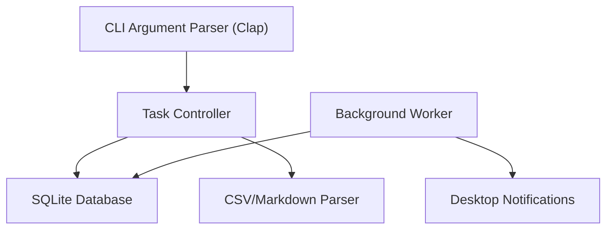

# CLI Todo App Specifications

## 1. Overview
A high-performance, robust Command Line Interface (CLI) application for managing task lists and subtasks. The application features local persistence via SQLite, support for bulk task operations through CSV/Markdown imports, and a background notification system for deadlines.

## 2. Technical Stack
- **Language:** Rust (Recommended for memory safety, performance, and rich CLI ecosystem).
- **Persistence:** SQLite (Local storage).
- **Background Tasks:** Dedicated background process/daemon (via a crate like `daemonize` or a systemd service).
- **Parsing:** `csv` crate (CSV), `pulldown-cmark` (Markdown).
- **CLI Framework:** `clap` (Command Line Argument Parser).

## 3. Core Features

### 3.1 Task Management
- **Create Task:** `todo add "Task name" --deadline "2026-04-10"`
- **Subtasks:** `todo add "Subtask" --parent <id>`
- **List Tasks:** `todo list` (with nested views for subtasks).
- **Delete/Complete:** `todo done <id>` or `todo delete <id>`.
- **Priority:** Support for High, Medium, Low priorities.

### 3.2 List Management
- Support for multiple named lists (e.g., "Work", "Personal").
- `todo list-create "Work"`

### 3.3 Data Import/Upload
- **CSV Import:** `todo import tasks.csv`
- **Markdown Import:** `todo import tasks.md` (Parsing checkboxes `- [ ]`).

### 3.4 Local Storage (SQLite)
- A local `.db` file stored in the user's config directory (e.g., `~/.config/todo-cli/todo.db`).
- Schema including `tasks`, `subtasks`, and `lists` tables.

### 3.5 Notifications & Deadlines
- A background process that monitors tasks for upcoming deadlines.
- **Notification Method:** Desktop notifications (via `notify-rust`) or local system logs.
- **Daemon Management:** commands to start/stop the background worker: `todo daemon start/stop`.

## 4. User Experience (CLI Design)
- **Rich Output:** Use colors and icons (e.g., `✔` for completed, `⏳` for pending).
- **Interactive Mode (Optional):** A TUI (Terminal User Interface) integrated for easy navigation using `ratatui`.
- **Search:** `todo search "query"` for finding tasks.

## 5. Proposed Architecture

## 6. Development Milestones
1.  **Phase 1:** Core CLI structure and SQLite integration.
2.  **Phase 2:** Subtask hierarchy and list management.
3.  **Phase 3:** CSV and Markdown import functionality.
4.  **Phase 4:** Background daemon for notifications.
5.  **Phase 5:** TUI and polishing (animations, colors).
